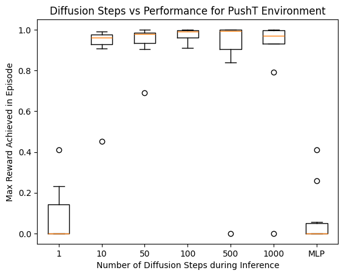

# Exploring Diffusion: From MNIST Generation to Robotic Control

This repository collects a sequence of diffusion-model experiments that start with image generation on MNIST and extend to policy learning and trajectory generation for robotics.

## Brief overview of main folders

- `ddpm/` - baseline denoising diffusion probabilistic model training and sampling on MNIST.
- `ddim/` - deterministic diffusion implicit sampling experiments for faster generation with fewer denoising steps.
- `diffusion_policy/` - action-diffusion policy learning experiments and evaluation rollouts.
- `diffuser/` - trajectory-level diffusion planning experiments with guided, inpainted, and obstacle-aware rollouts.

### Main notebooks

- `ddpm/ddpm_test.ipynb`
- `ddim/ddim_test.ipynb`
- `diffusion_policy/diffusion_policy.ipynb`
- `diffuser/diffuser.ipynb`

## DDPM video result

<video src="ddpm/cosine/ddpm_sampling_cosine_2026-03-27_01-48-31.mp4" controls muted playsinline width="720"></video>

## DDIM video result

<video src="ddim/cosine/ddim_comparison.mp4" controls muted playsinline width="720"></video>

## Diffusion Policy results

<video src="diffusion_policy/results/dp_1000denoising_100inference.mp4" controls muted playsinline width="720"></video>

## Diffuser results
### Randomly sampled trajectories without obstacle avoidance
This video shows that diffuser understands what a "smooth" trajectory looks like.
<video src="diffuser/results/random_sampled_trajectories.mp4" controls muted playsinline width="720"></video>

### Inpainted trajectories
This video shows that we can guide Diffuser to start and end in a particular configuration through inpainting.
<video src="diffuser/results/inpainted_trajectories_good.mp4" controls muted playsinline width="720"></video>

### Obstacle-averse trajectory
This video shows that we can guide Diffuser to avoid obstacles at runtime through classifier-guided diffusion, rather than through training. Though this video shows a very jerky trajectory, the original authors of the paper were able to produce good results, and I am confident that further tuning can improve this example much more.
<video src="diffuser/results/guided_trajectory_obstacle_averse.mp4" controls muted playsinline width="720"></video>

## Papers cited

1. Ho, J., Jain, A., & Abbeel, P. (2020). Denoising diffusion probabilistic models. Advances in Neural Information Processing Systems, 33, 6840–6851.
2. Song, J., Meng, C., & Ermon, S. (2020). Denoising diffusion implicit models. arXiv preprint arXiv:2010.02502.
3. Janner, M., Du, Y., Tenenbaum, J., & Levine, S. (2022). Planning with diffusion for flexible behavior synthesis. arXiv preprint arXiv:2205.09991.
4. Chi, C., Xu, Z., Feng, S., Cousineau, E., Du, Y., Burchfiel, B., Tedrake, R., & Song, S. (2025). Diffusion policy: Visuomotor policy learning via action diffusion. The International Journal of Robotics Research, 44(10–11), 1684–1704.
5. Perez, E., Strub, F., De Vries, H., Dumoulin, V., & Courville, A. (2018). FiLM: Visual reasoning with a general conditioning layer. In Proceedings of the AAAI Conference on Artificial Intelligence.
6. Dhariwal, P., & Nichol, A. (2021). Diffusion models beat GANs on image synthesis. Advances in Neural Information Processing Systems, 34, 8780–8794.

## Notes

- The MNIST experiments focus on diffusion schedules, denoising behavior, and sample quality.
- The robotics sections show how diffusion methods can be adapted for planning and policy learning.
- Check the notebooks for training details, visuals, and experiment-specific outputs.
